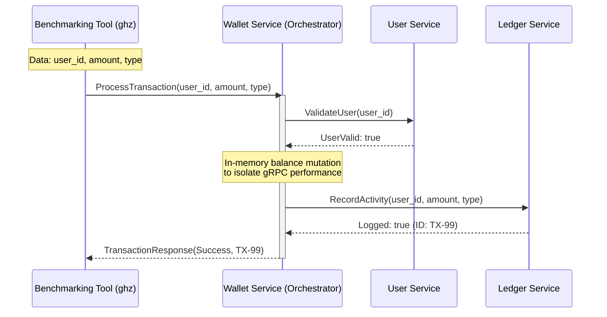

# Go vs Node.js gRPC Performance Evaluation
> This repository contains a comparative study designed to evaluate the performance of gRPC as a communication protocol within a microservices ecosystem. By implementing a three-tier chained service architecture (User, Wallet, and Ledger Services) in both Go and Node.js, this project analyzes key performance metrics such as latency distribution, throughput, and resource utilization under various stress-load scenarios.

## 🧱 Microservices Interaction Overview

## ⚙ Tech Stack
- **Language A:** Go (Native gRPC implementation)
- **Language B:** Node.js (@grpc/grpc-js)
- **Protocol:** Protocol Buffers (v3)
- **Benchmarking Tool:** ghz